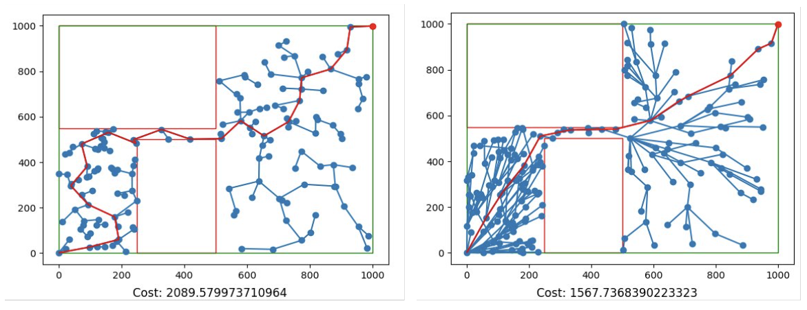

# Rapidly Exploring Random Trees (RRT) – Path Planning Optimization

## Project Summary

This project features a complete NumPy implementation of the **Rapidly Exploring Random Trees (RRT)** algorithm for flight path planning.

Last semester, the original algorithm was found to be incorrect, leading to incomplete and inefficient search behavior. We have since patched the **logical errors** and made substantial improvements to both performance and visualization.

---

## Key Improvements

-  Fixed algorithmic bugs and logic errors from previous implementation
-  Added support for **RRT\*** — a more advanced version of RRT that rewires paths as better ones are discovered
-  Optimized the algorithm with **dynamic path rewiring** to lower the cost of the planned route
-  Achieved up to **200 unit reduction in path cost**
-  Fast planning — algorithm completes in **under 5 seconds** with proper tuning
-  GUI enhancements:
  - Planned paths and boundaries are now clearly visible
  - Improved interactivity and debugging support

---

##  Results

| Metric               | Before        | After         |
|----------------------|---------------|---------------|
| Average Path Cost    | 1819.78       | **1548.92**   |
| Minimum Path Cost    | 1651.41       | **1503.48**   |

---

##  Visualizations

### Algorithm Performance Before and After Optimization



---

##  Code Highlight

The RRT* implementation rewires paths dynamically when a shorter path is discovered:
```python
def rewire(self, cps, node):
    for i in cps:
        ...
        if cost < i.cost:
            i.prev, i.cost = prev, prev_cost
